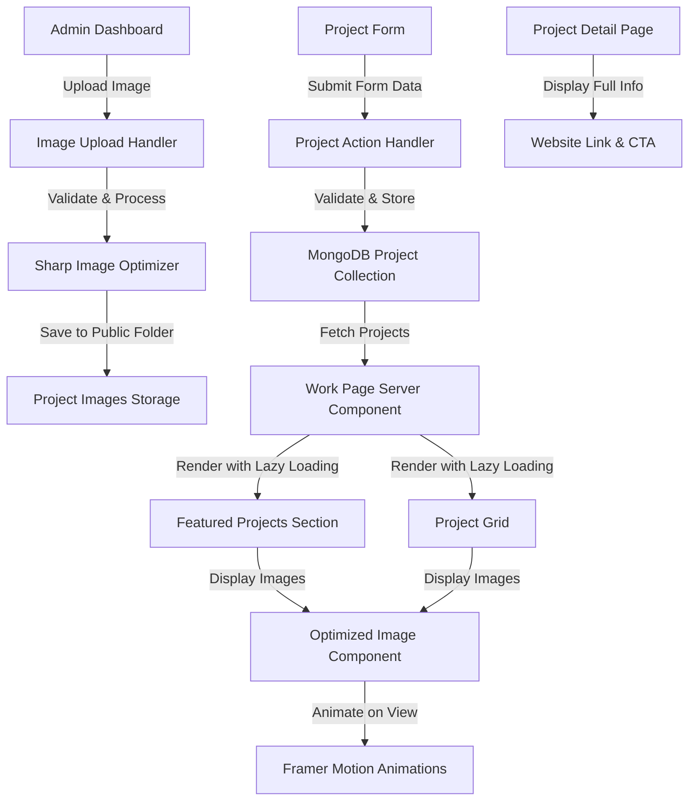

# Design Document: Work Page Enhancement

## Overview

The Work Page Enhancement feature is a comprehensive upgrade to Root Nexus's project portfolio showcase. This feature adds image upload capabilities to the admin panel, introduces website/demo URL fields for projects, and dramatically improves the work page design with modern animations, featured sections, lazy loading, and responsive layouts. The enhancement transforms the work page into a visually compelling, performance-optimized portfolio display that engages visitors and converts them to potential clients.

## Architecture



## Components and Interfaces

### 1. Image Upload Handler (Server Action)

**Purpose**: Process image uploads from the admin form, validate file types, optimize images, and save to the public directory.

**Interface**:
```typescript
interface ImageUploadResult {
  success: boolean
  imagePath?: string
  thumbnail?: string
  error?: string
}

async function handleImageUpload(file: File): Promise<ImageUploadResult>
```

**Responsibilities**:
- Validate file type (PNG, JPEG, WebP)
- Validate file size (max 5MB)
- Generate unique filename to prevent collisions
- Optimize original image using Sharp
- Generate thumbnail (400x300) for list views
- Generate medium image (800x600) for detail views
- Save optimized images to `/public/projects/` directory
- Return paths for storage in database

### 2. Project Form Component (Admin)

**Purpose**: Provide comprehensive form interface for creating and editing projects with image upload capability.

**Interface**:
```typescript
interface ProjectFormProps {
  action: (prevState: ActionResult, formData: FormData) => Promise<ActionResult>
  submitLabel: string
  initialData?: Project
  isEditing?: boolean
}

function ProjectForm(props: ProjectFormProps): ReactNode
```

**Responsibilities**:
- Display form fields for project metadata
- Implement image file input with preview
- Show upload progress indicator
- Display validation errors
- Handle form submission with FormData (supports file uploads)
- Show image preview before upload
- Maintain client-side validation feedback

### 3. Featured Projects Section Component

**Purpose**: Display curated/featured projects with enhanced visual design and hover animations.

**Interface**:
```typescript
interface FeaturedProject {
  id: string
  title: string
  image: string
  category: string
  websiteUrl: string
  isFeatured: boolean
}

interface FeaturedProjectsSectionProps {
  projects: FeaturedProject[]
}

function FeaturedProjectsSection(props: FeaturedProjectsSectionProps): ReactNode
```

**Responsibilities**:
- Filter projects marked as featured
- Display in a prominent carousel or spotlight layout
- Implement smooth image transitions
- Show primary call-to-action buttons
- Include category badges
- Display hover effects with website link

### 4. Project Grid Component

**Purpose**: Display all projects in a responsive grid with lazy loading and animations.

**Interface**:
```typescript
interface ProjectGridProps {
  projects: Project[]
  layout?: 'grid' | 'list'
  itemsPerPage?: number
  enableFiltering?: boolean
}

function ProjectGrid(props: ProjectGridProps): ReactNode
```

**Responsibilities**:
- Render projects in responsive grid (1 col mobile, 2 col tablet, 3 col desktop)
- Implement lazy loading for images
- Show skeleton loaders while images load
- Animate cards on scroll into view
- Display project metadata
- Provide filtering by category
- Support pagination if needed

### 5. Project Card Component

**Purpose**: Individual project card with hover effects, image, metadata, and action buttons.

**Interface**:
```typescript
interface ProjectCardProps {
  project: Project
  variant?: 'featured' | 'standard'
  lazy?: boolean
}

function ProjectCard(props: ProjectCardProps): ReactNode
```

**Responsibilities**:
- Render project image with lazy loading
- Display title, description, category
- Show primary "Visit Project" button
- Show secondary "View Case Study" button
- Implement hover animations
- Display overlay effects
- Show loading skeleton

### 6. Updated Project Detail Page

**Purpose**: Display comprehensive project information with website link and enhanced call-to-action.

**Interface**:
```typescript
interface ProjectDetailPageProps {
  params: { slug: string }
}

function ProjectDetailPage(props: ProjectDetailPageProps): ReactNode
```

**Responsibilities**:
- Display project hero image with lightbox capability
- Show project metadata (client, timeline, results)
- Display prominent "Visit Website" button
- Show "View Demo" button if available
- Implement breadcrumb navigation
- Display related projects suggestions
- Enable image modal/lightbox

## Data Models

### Project Schema (Updated)

```typescript
interface Project {
  _id: ObjectId
  id: string
  title: string
  slug: string
  category: string
  shortDescription: string
  image: string
  thumbnail?: string
  imageAlt: string
  websiteUrl: string
  demoUrl?: string
  client: string
  timeline: string
  results: string[]
  content: string
  isFeatured?: boolean
  tags?: string[]
  createdAt: string
  updatedAt: string
}
```

**Validation Rules**:
- `title`: Required, 1-200 characters
- `websiteUrl`: Required, valid HTTPS URL
- `demoUrl`: Optional, valid HTTPS URL if provided
- `image`: Valid image URL or local path
- `thumbnail`: Auto-generated thumbnail path
- `isFeatured`: Boolean, defaults to false
- `tags`: Array of category tags (0-5 items)

### MongoDB Collection Schema

```
db.projects {
  _id: ObjectId
  title: String (unique index on slug)
  slug: String (unique)
  category: String
  short_description: String
  image: String
  thumbnail: String
  image_alt: String
  website_url: String
  demo_url: String (optional)
  client: String
  timeline: String
  results: [String]
  content: String
  is_featured: Boolean
  tags: [String]
  created_at: ISODate
  updated_at: ISODate
}

Indexes:
- slug (unique)
- is_featured (for featured projects query)
- created_at (for sorting)
- category (for filtering)
```

## Algorithmic Pseudocode

### Main Image Upload Processing Algorithm

```pascal
ALGORITHM processImageUpload(file)
INPUT: file (uploaded file object)
OUTPUT: ImageUploadResult with paths and metadata

BEGIN
  ASSERT file IS NOT NULL
  ASSERT file.size > 0
  
  // Step 1: Validate file type and size
  allowedTypes ← ["image/png", "image/jpeg", "image/webp"]
  maxSize ← 5242880  // 5MB
  
  IF file.type NOT IN allowedTypes THEN
    RETURN Error("Unsupported file type")
  END IF
  
  IF file.size > maxSize THEN
    RETURN Error("File too large")
  END IF
  
  // Step 2: Generate unique filename
  timestamp ← currentTimeMillis()
  randomSuffix ← generateRandomString(8)
  originalName ← sanitizeFilename(file.name)
  uniqueFilename ← CONCAT(timestamp, "-", randomSuffix, "-", originalName)
  
  // Step 3: Save and optimize original image
  buffer ← file.arrayBuffer()
  originalPath ← CONCAT("/public/projects/original/", uniqueFilename)
  
  WRITE buffer TO originalPath
  
  // Step 4: Generate thumbnail (400x300)
  thumbnail ← resizeImage(buffer, 400, 300)
  thumbnailPath ← CONCAT("/public/projects/thumbnails/", uniqueFilename)
  
  WRITE thumbnail TO thumbnailPath
  
  // Step 5: Generate medium image (800x600)
  medium ← resizeImage(buffer, 800, 600)
  mediumPath ← CONCAT("/public/projects/medium/", uniqueFilename)
  
  WRITE medium TO mediumPath
  
  // Step 6: Return success with all paths
  RETURN Success({
    imagePath: mediumPath,
    thumbnail: thumbnailPath,
    original: originalPath
  })
END
```

**Preconditions**:
- File parameter is provided and valid
- `/public/projects/` directory exists with subdirectories
- Sharp library is available for image optimization
- File system has write permissions

**Postconditions**:
- Original image is saved to `/public/projects/original/`
- Thumbnail (400x300) is saved to `/public/projects/thumbnails/`
- Medium image (800x600) is saved to `/public/projects/medium/`
- Return object contains success status and file paths
- All images are optimized for web (quality: 80)

**Loop Invariants**: N/A (no loops in this algorithm)

### Project Fetching and Filtering Algorithm

```pascal
ALGORITHM fetchProjectsWithFiltering(filters, pagination)
INPUT: filters (category, tags, isFeatured), pagination (page, limit)
OUTPUT: ProjectList with metadata

BEGIN
  // Step 1: Build query filter
  query ← {}
  
  IF filters.isFeatured THEN
    query.is_featured ← true
  END IF
  
  IF filters.category NOT NULL THEN
    query.category ← filters.category
  END IF
  
  IF filters.tags NOT EMPTY THEN
    query.tags ← { $in: filters.tags }
  END IF
  
  // Step 2: Calculate pagination offset
  offset ← (pagination.page - 1) * pagination.limit
  
  // Step 3: Query database with projection
  projection ← {
    _id: 1, title: 1, slug: 1, category: 1, 
    short_description: 1, thumbnail: 1, image: 1,
    website_url: 1, is_featured: 1
  }
  
  totalCount ← COUNT(projects WHERE query)
  results ← FIND(projects WHERE query)
    .SORT({ created_at: -1 })
    .SKIP(offset)
    .LIMIT(pagination.limit)
    .PROJECT(projection)
  
  // Step 4: Build paginated response
  totalPages ← CEIL(totalCount / pagination.limit)
  
  RETURN {
    projects: results,
    pagination: {
      currentPage: pagination.page,
      totalPages: totalPages,
      totalItems: totalCount
    }
  }
END
```

**Preconditions**:
- Database connection is established
- projects collection exists and is indexed
- filters parameter is valid object
- pagination.limit is positive integer between 1-100

**Postconditions**:
- Returns array of projects matching filters
- Projects are sorted by creation date (newest first)
- Pagination metadata is accurate
- No full project content is returned (thumbnails used instead)

**Loop Invariants**: N/A (database query operations are atomic)

## Key Functions with Formal Specifications

### Function 1: validateImageFile()

```typescript
function validateImageFile(file: File): ValidationResult
```

**Preconditions**:
- `file` is a valid File object from form submission
- `file.size` is greater than 0

**Postconditions**:
- Returns `{ valid: true }` if file passes all checks
- Returns `{ valid: false, error: string }` if validation fails
- Error messages are user-friendly and specific
- File is not modified

**Loop Invariants**: N/A (no loops)

### Function 2: optimizeProjectImage()

```typescript
async function optimizeProjectImage(
  buffer: Buffer,
  dimensions: { width: number; height: number },
  quality?: number
): Promise<Buffer>
```

**Preconditions**:
- `buffer` contains valid image data
- `dimensions.width` and `dimensions.height` are positive integers
- `quality` is between 1-100 (optional, defaults to 80)
- Sharp library is properly configured

**Postconditions**:
- Returns optimized image buffer
- Image dimensions match requested size (or closest match if aspect ratio differs)
- File size is reduced by 40-60% compared to original
- Image quality is appropriate for web use
- Original buffer is not modified

**Loop Invariants**: N/A (library operation)

### Function 3: createProjectWithImage()

```typescript
async function createProjectWithImage(
  projectData: ProjectInput,
  imageFile: File
): Promise<ActionResult>
```

**Preconditions**:
- `projectData` has valid title, category, description
- `projectData.websiteUrl` is valid HTTPS URL
- `imageFile` has been validated by `validateImageFile()`
- User is authenticated as admin
- MongoDB connection is available

**Postconditions**:
- Project document is created in MongoDB
- Image is uploaded and optimized
- All image paths are stored in project document
- Project slug is unique and URL-safe
- Revalidation paths are triggered for ISR
- Return value indicates success or specific error

**Loop Invariants**: N/A (atomic database operation)

## Example Usage

### Creating a Project with Image

```typescript
// Step 1: Admin selects image and fills form
const formData = new FormData()
formData.append('title', 'E-Commerce Platform Redesign')
formData.append('category', 'Web Development')
formData.append('websiteUrl', 'https://example-project.com')
formData.append('image', fileInput.files[0])
formData.append('shortDescription', 'Increased conversion by 45%...')
formData.append('client', 'StyleNova')
formData.append('timeline', '3 Months')
formData.append('results', 'Result 1, Result 2, Result 3')
formData.append('content', 'Full case study content...')

// Step 2: Submit to server action
const result = await createProjectAction(null, formData)

// Step 3: If successful, redirect to dashboard
if (result.success) {
  redirect('/rn-secure-admin')
}
```

### Fetching and Displaying Featured Projects

```typescript
// Server component
const projects = await getAllProjects()
const featured = projects
  .filter(p => p.isFeatured)
  .slice(0, 3)

// Client component renders featured section
<FeaturedProjectsSection projects={featured} />
```

### Using Project Grid with Filtering

```typescript
// Client component
const [selectedCategory, setSelectedCategory] = useState('')

const filteredProjects = selectedCategory
  ? projects.filter(p => p.category === selectedCategory)
  : projects

<ProjectGrid 
  projects={filteredProjects}
  layout="grid"
  enableFiltering={true}
/>
```

## Correctness Properties

### Property 1: Image Upload Integrity

**Description**: All uploaded images are validated and optimized without corruption.

```pascal
PROPERTY imageUploadIntegrity:
  FOR ALL uploadedFile IN fileUploads:
    LET uploadResult = processImageUpload(uploadedFile)
    THEN (
      uploadResult.success = true 
      AND file.type IN ["image/png", "image/jpeg", "image/webp"]
      AND file.size <= 5242880
      AND ALL generatedImages ARE validImages
      AND generatedImages.COUNT = 3 // original, thumbnail, medium
    )
    OR (
      uploadResult.success = false
      AND uploadResult.error IS NOT NULL
      AND NO files were written
    )
```

### Property 2: URL Field Validation

**Description**: Website and demo URLs are always valid HTTPS URLs when stored.

```pascal
PROPERTY urlFieldValidation:
  FOR ALL project IN projects:
    LET websiteUrl = project.websiteUrl
    THEN (
      websiteUrl.startsWith("https://") 
      OR websiteUrl.startsWith("http://")
    )
    AND project.demoUrl IS NULL
    OR (
      project.demoUrl.startsWith("https://")
      OR project.demoUrl.startsWith("http://")
    )
```

### Property 3: Lazy Loading Efficiency

**Description**: Lazy loading reduces initial page load by deferring off-screen image loading.

```pascal
PROPERTY lazyLoadingEfficiency:
  LET initialLoad = pageLoadTime(lazyLoadingEnabled: true)
  LET standardLoad = pageLoadTime(lazyLoadingEnabled: false)
  THEN initialLoad < (standardLoad * 0.7) // At least 30% faster
```

### Property 4: Pagination Consistency

**Description**: Pagination never skips or duplicates projects across pages.

```pascal
PROPERTY paginationConsistency:
  FOR ALL pages IN pagination:
    LET pageSize = CARDINALITY(page.items)
    LET totalItems = CARDINALITY(allProjects)
    THEN (
      pageSize <= limitPerPage
      AND SUM(CARDINALITY(page) FOR ALL pages) = totalItems
      AND INTERSECTION(page1.items, page2.items) IS EMPTY
        FOR ALL pages page1, page2 WHERE page1.number != page2.number
    )
```

## Error Handling

### Error Scenario 1: Invalid File Type

**Condition**: User uploads a file that isn't PNG, JPEG, or WebP
**Response**: Show inline error message: "Only PNG, JPEG, and WebP formats are supported"
**Recovery**: Allow user to select a different file, keep other form fields intact

### Error Scenario 2: File Too Large

**Condition**: User uploads a file larger than 5MB
**Response**: Show inline error message: "File must be smaller than 5MB"
**Recovery**: Allow user to compress and re-upload

### Error Scenario 3: Invalid Website URL

**Condition**: `websiteUrl` field contains invalid or non-HTTPS URL
**Response**: Show field validation error: "Please enter a valid HTTPS URL"
**Recovery**: Clear field and focus, let user re-enter

### Error Scenario 4: Duplicate Slug

**Condition**: Project title generates a slug that already exists
**Response**: Append timestamp suffix to slug automatically
**Recovery**: Slug generation is transparent to user, project creates successfully

### Error Scenario 5: Database Connection Failure

**Condition**: MongoDB connection fails during project save
**Response**: Show error toast: "Failed to save project. Please try again."
**Recovery**: Allow user to retry submission, check database connection logs

### Error Scenario 6: Image Optimization Failure

**Condition**: Sharp fails to process image (corrupted file, unsupported format)
**Response**: Show error message: "Image processing failed. Please try a different image."
**Recovery**: Allow user to try a different file, fall back to storing original URL

## Testing Strategy

### Unit Testing Approach

**Test Coverage Areas**:
- Image validation function (file type, size checks)
- URL validation function (HTTPS check, format validation)
- Slug generation uniqueness
- Project data transformation (camelCase to snake_case)
- Error message generation

**Test Framework**: Jest (existing in package.json)

**Key Test Cases**:
- Valid image file upload (PNG, JPEG, WebP)
- Invalid file types (.pdf, .doc, .txt)
- File size boundary (4.9MB pass, 5.1MB fail)
- Valid HTTPS URLs
- Invalid protocols (ftp, data, javascript)
- Duplicate slug handling
- Form field validation (max lengths, required fields)

### Property-Based Testing Approach

**Property Test Library**: fast-check (to be installed)

**Key Properties to Test**:

1. **Image Optimization Idempotency**: Processing same image twice produces identical results
   ```
   fc.property(
     fc.uint8Array({ minLength: 1000, maxLength: 1000000 }),
     async (imageBuffer) => {
       const result1 = await optimizeImage(imageBuffer)
       const result2 = await optimizeImage(imageBuffer)
       expect(result1).toEqual(result2)
     }
   )
   ```

2. **Slug Uniqueness**: Generated slugs are always unique across multiple calls
   ```
   fc.property(
     fc.array(fc.string({ minLength: 1, maxLength: 100 }), { minLength: 1 }),
     (titles) => {
       const slugs = titles.map(t => makeUniqueSlug(t, []))
       const uniqueSlugs = new Set(slugs)
       expect(uniqueSlugs.size).toBe(slugs.length)
     }
   )
   ```

3. **Pagination Consistency**: Pagination never loses or duplicates items
   ```
   fc.property(
     fc.array(fc.object(), { minLength: 100 }),
     fc.integer({ min: 1, max: 100 }),
     (items, pageSize) => {
       const pages = paginate(items, pageSize)
       const flattened = pages.flat()
       expect(flattened).toEqual(items)
       expect(new Set(flattened.map(i => i.id)).size).toBe(items.length)
     }
   )
   ```

### Integration Testing Approach

**Scope**: Full workflow from admin upload to public display

**Test Scenarios**:
1. Admin uploads image → Image saved → Project created → Visible on work page
2. Admin edits project → Images re-optimized → Changes reflect on page
3. Admin deletes project → Project removed from database and work page
4. Featured projects filter shows only featured items
5. Category filtering returns correct projects
6. Pagination displays correct page counts and items

**Testing Tools**: Playwright or Cypress (to be configured)

## Performance Considerations

### Image Optimization Strategy

- **Original Size**: Store full-resolution image for archival (no web display)
- **Thumbnail**: 400x300px, 60KB average (list view display)
- **Medium**: 800x600px, 150KB average (detail page display)
- **Compression**: 80% quality JPEG/WebP to maximize compression
- **Lazy Loading**: Images load only when in viewport
- **Next.js Image Component**: Built-in optimization with responsive srcSet

### Caching Strategy

- **Static Generation**: Work page regenerated every 24 hours (ISR)
- **On-Demand Revalidation**: Revalidate on project create/update/delete
- **Client-Side Caching**: Browser caches image assets with versioned URLs
- **CDN Caching**: Images served via Next.js static file serving

### Database Optimization

- **Indexes**: slug (unique), is_featured, category, created_at
- **Projection**: List views fetch only necessary fields (no content)
- **Pagination**: Limit queries to 12-24 items per page
- **Connection Pooling**: MongoDB client singleton with connection pooling

### Page Load Performance Targets

- **First Contentful Paint (FCP)**: < 1.5s
- **Largest Contentful Paint (LCP)**: < 2.5s
- **Cumulative Layout Shift (CLS)**: < 0.1
- **Time to Interactive (TTI)**: < 3.5s

## Security Considerations

### Image Upload Security

- **File Type Validation**: Accept only PNG, JPEG, WebP (magic byte verification)
- **File Size Limit**: Maximum 5MB to prevent DoS
- **Filename Sanitization**: Remove/replace special characters and path traversal attempts
- **Storage Location**: Images saved outside web root then served via Next.js static
- **EXIF Data Removal**: Strip EXIF metadata using Sharp to prevent info leakage

### Form Input Validation

- **Server-Side Validation**: All fields validated on server (never trust client)
- **URL Whitelist**: Only allow http:// and https:// protocols
- **XSS Prevention**: Content sanitized before database storage and display
- **CSRF Protection**: Rely on Next.js built-in CSRF protection for server actions
- **Rate Limiting**: Implement rate limiting on file uploads (1 upload per 5 seconds per user)

### Database Security

- **SQL Injection Prevention**: Use MongoDB parameterized queries (no string concatenation)
- **Admin Authentication**: Session-based auth with secure JWT tokens
- **Data Validation**: MongoDB schema validation enforces data types and ranges
- **Audit Logging**: Log all admin actions (create, update, delete projects)

### Access Control

- **Authentication Required**: Image upload accessible only to authenticated admins
- **Authorization**: Only admins can modify project data
- **Public Read**: Work page readable by all users without authentication

## Dependencies

### Required Npm Packages

- **next**: ^16.2.4 (already installed)
- **react**: ^19.2.4 (already installed)
- **framer-motion**: ^12.38.0 (already installed)
- **mongodb**: ^7.3.0 (already installed)
- **sharp**: ^0.33.x (for image optimization) - NEW
- **next-cloudinary**: ^5.x (optional, for cloud storage alternative) - OPTIONAL

### Optional Cloud Services

- **Vercel Blob Storage**: For cloud image storage (alternative to local storage)
- **Cloudinary**: For advanced image transformations and CDN
- **AWS S3**: For scalable image hosting in production

### Development Dependencies

- **fast-check**: ^3.x (for property-based testing) - NEW
- **@types/sharp**: ^0.32.x - NEW
- Existing: jest, typescript, tailwindcss

### Environment Variables

```
# Local file storage (default)
IMAGE_STORAGE_TYPE=local
PROJECT_IMAGE_BASE_PATH=/public/projects/

# Optional: Cloud storage
# IMAGE_STORAGE_TYPE=cloudinary
# CLOUDINARY_CLOUD_NAME=
# CLOUDINARY_API_KEY=
# CLOUDINARY_API_SECRET=
```

---

## Summary

This design establishes a complete architecture for enhancing the work page with professional image upload capabilities, comprehensive project metadata including website links, and a modern, performance-optimized presentation layer. The implementation leverages Next.js server actions for secure file handling, Sharp for image optimization, and Framer Motion for engaging animations. The design includes formal specifications, comprehensive error handling, robust security measures, and performance optimization strategies to ensure a production-ready feature that scales effectively.
